<div align="center">



[](https://git.io/typing-svg)

[](https://www.linkedin.com/in/luis-gomez-acebo-martin-retortillo/)
[](mailto:gomez.acebo.luis@gmail.com)

</div>

---

### `~/whoami`

I like problems that sit in the awkward space between disciplines — where a clean software answer isn't enough and you have to think about hardware, biology, or economics too. Most of what I build starts with the same question: *what if this thing could just take care of itself?*

Most days I'm reading papers, breaking soldering joints, or arguing with a model that refuses to converge.

---

### `~/toolkit`

<div align="center">


<br><br>

<sub>`agents · llms · vectors`</sub>

<br>


</div>

---

### `~/principles`

```
  01.  ship the ugly version first
  02.  hardware will betray you — plan for it
  03.  the boring solution usually wins
  04.  if you can't explain it on a napkin, rebuild it
```

---

<div align="center">

### `~/activity`


<br><br>


</div>
